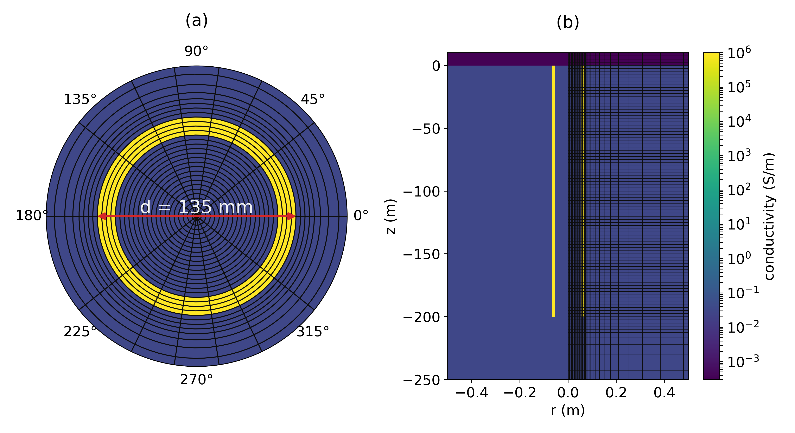

# Modeling electromagnetics on cylindrical meshes with applications to steel-cased wells

_Lindsey J. Heagy and Douglas W. Oldenburg_

[https://doi.org/10.1016/j.cageo.2018.11.010]



# Summary 

Simulating direct current resistivity, frequency domain electromagnetics and time domain electromagnetics in settings where steel cased boreholes are present is of interest across a range of applications including well-logging, monitoring subsurface injections such as hydraulic fracturing or carbon capture and storage. In some surveys, well-casings have been used as “extended electrodes” for near surface environmental or geotechnical applications. Wells are often cased with steel, which has both a high conductivity and a significant magnetic permeability. The large physical property contrasts as well as the large disparity in length-scales, which are introduced when a steel-cased well is in a modeling domain, makes performing an electromagnetic forward simulation challenging. Using this setting as motivation, we present a finite volume approach for modeling electromagnetic problems on cylindrically symmetric and 3D cylindrical meshes which include an azimuthal discretization. The associated software implementation includes modeling capabilities for direct current resistivity, time domain electromagnetics, and frequency domain electromagnetics for models that include variable electrical conductivity and magnetic permeability. Electric and magnetic fields, fluxes, and charges are readily accessible in any simulation so that they can be visualized and interrogated. We demonstrate the value of being able to explore the behavior of electromagnetic fields and fluxes through examples which revisit a number of foundational papers on direct current resistivity and electromagnetics in steel-cased wells. The software implementation is open source and included as a part of the SimPEG software ecosystem for simulation and parameter estimation in geophysics. 

# Citation

Lindsey J Heagy, Douglas W Oldenburg, Direct current resistivity with steel-cased wells, Geophysical Journal International, Volume 219, Issue 1, October 2019, Pages 1–26, https://doi.org/10.1093/gji/ggz281

```
@article{heagy_impacts_2019,
	title = {Modeling electromagnetics on cylindrical meshes with applications to steel-cased wells},
	volume = {125},
	issn = {0098-3004},
	url = {https://www.sciencedirect.com/science/article/pii/S009830041830390X},
	doi = {10.1016/j.cageo.2018.11.010},
	number = {},
	urldate = {2019-03-07},
	journal = {Computers & Geosciences},
	author = {Lindsey J. Heagy and Douglas W. Oldenburg},
	month = {03},
	year = {2019},
	pages = {115-130},
}
```
